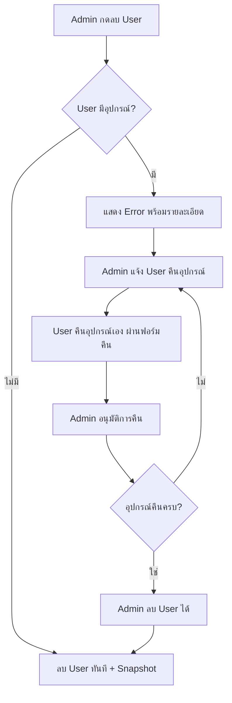

# 📋 User Deletion Workflow - System Update

## 🎯 สรุปการเปลี่ยนแปลง

ระบบได้รับการปรับปรุงให้ **User ต้องคืนอุปกรณ์เอง** แทนการสร้าง auto-return เพื่อให้ได้ข้อมูลที่ครบถ้วนและถูกต้อง

---

## 🔄 Workflow ใหม่: การลบ User ที่มีอุปกรณ์

### ✅ **กระบวนการใหม่**



### 📊 **เปรียบเทียบ Workflow**

| | **Workflow เดิม** | **Workflow ใหม่** |
|---|---|---|
| **User มีอุปกรณ์** | สร้าง auto-return + pending deletion | แสดง error + รายการอุปกรณ์ |
| **การคืนอุปกรณ์** | Auto-return (ไม่มีข้อมูลครบ) | User คืนเอง (มีข้อมูลครบ) |
| **ข้อมูลในฟอร์ม** | ไม่มี | สถานะ/สภาพ/รูปภาพ |
| **User Action** | ไม่ต้องทำอะไร | ต้องคืนเอง |

---

## 🛠️ ไฟล์ที่แก้ไข

### 1️⃣ **API - User Deletion** 
**File:** `src/app/api/admin/users/[id]/route.ts`

**การเปลี่ยนแปลง:**
- ❌ **ลบ:** การสร้าง auto-return log
- ❌ **ลบ:** การทำเครื่องหมาย pending deletion
- ❌ **ลบ:** การ logout User อัตโนมัติ
- ✅ **เพิ่ม:** Error response พร้อมรายละเอียดอุปกรณ์
- ✅ **เพิ่ม:** ข้อมูลติดต่อ User

**Response เมื่อ User มีอุปกรณ์:**
```json
{
  "error": "ไม่สามารถลบผู้ใช้ได้",
  "message": "ผู้ใช้มีอุปกรณ์ 3 รายการที่ต้องคืนก่อน กรุณาแจ้งให้ผู้ใช้คืนอุปกรณ์ผ่านหน้า \"คืนอุปกรณ์\" หรือติดต่อผู้ใช้โดยตรง",
  "equipmentCount": 3,
  "equipmentList": [
    "Mouse SE1 (S/N: 0845641456)",
    "Keyboard (S/N: KB001)",
    "Monitor"
  ],
  "userContact": {
    "name": "สมชาย ใจดี",
    "phone": "0812345678",
    "email": "somchai@company.com",
    "office": "สำนักงานใหญ่"
  },
  "hasEquipment": true,
  "requiresUserAction": true
}
```

### 2️⃣ **Model - DeletedUser**
**File:** `src/models/DeletedUser.ts`

**การเปลี่ยนแปลง:**
- ✅ **เพิ่ม:** `userType?: 'individual' | 'branch'`

**ประโยชน์:**
- เก็บประเภทผู้ใช้สำหรับการแสดงผลที่ถูกต้อง
- รองรับการ populate ที่แตกต่างกันระหว่าง individual และ branch user

### 3️⃣ **Populate Functions**
**Files:** 
- `src/lib/equipment-populate-helpers.ts`
- `src/lib/issue-helpers.ts`

**การเปลี่ยนแปลง:**
- ✅ **เพิ่ม:** Documentation ที่ชัดเจนสำหรับ Branch User
- ✅ **เพิ่ม:** การ populate phone และ email สำหรับ Branch User
- ✅ **ปรับปรุง:** Comments อธิบายว่า snapshot จากฟอร์ม ≠ ข้อมูลล่าสุดก่อนลบ

---

## 📝 ความเข้าใจเกี่ยวกับ Snapshot

### 🔍 **Individual User**
- **ข้อมูลทั้งหมด** → Populate จาก User collection (real-time)
- **เมื่อถูกลบ** → ใช้ snapshot จาก DeletedUsers
- **Snapshot = ข้อมูลล่าสุดก่อนลบ** ✅

### 🏢 **Branch User**

#### **ข้อมูลสาขา** (office, phone, email)
- Populate จาก User collection (real-time)
- เมื่อถูกลบ → ใช้ snapshot จาก DeletedUsers
- **Snapshot = ข้อมูลล่าสุดก่อนลบ** ✅

#### **ข้อมูลส่วนตัว** (firstName, lastName, nickname, department)
- **ไม่มีในระบบ** (Branch User ไม่เก็บข้อมูลเหล่านี้)
- ใช้จาก snapshot ในฟอร์ม (requesterFirstName, returnerFirstName, etc.)
- **Snapshot = ข้อมูลที่กรอกในแต่ละครั้ง** ⚠️
- **ไม่ใช่ข้อมูลล่าสุดก่อนลบ** ❌

**ตัวอย่าง:**
```
1 ม.ค. - เบิกเมาส์ → กรอก "นางสาวสุดา ใจดี (ดา) - ฝ่ายขาย"
15 ม.ค. - เบิกคีย์บอร์ด → กรอก "สุดา ใจดี (ดา) - ฝ่ายการตลาด"
30 ม.ค. - คืนเมาส์ → กรอก "นางสาวสุดา ใจดี (ดา) - ฝ่ายขาย"
31 ม.ค. - ลบ User

หลังลบ:
- ประวัติเบิกเมาส์ → แสดง "นางสาวสุดา ใจดี (ดา) - ฝ่ายขาย"
- ประวัติเบิกคีย์บอร์ด → แสดง "สุดา ใจดี (ดา) - ฝ่ายการตลาด"
```

---

## ✅ ข้อดีของระบบใหม่

### 1️⃣ **ข้อมูลครบถ้วน**
- User กรอก **สถานะอุปกรณ์** (มี/หาย)
- User กรอก **สภาพอุปกรณ์** (ใช้งานได้/ชำรุด)
- User อัปโหลด **รูปภาพ** ประกอบ
- User กรอก **เลขทรัพย์สิน** (ถ้ามี)

### 2️⃣ **ความถูกต้อง**
- User เป็นคนตรวจสอบอุปกรณ์จริง
- ข้อมูลสถานะ/สภาพ ถูกต้องแม่นยำ
- มีหลักฐานภาพถ่าย

### 3️⃣ **ความรับผิดชอบ**
- User ต้องดำเนินการเอง
- ไม่สามารถปัดความรับผิดชอบได้

### 4️⃣ **ความปลอดภัย**
- Admin ต้องอนุมัติการคืนก่อน
- ตรวจสอบความถูกต้องของข้อมูล

---

## 🎯 คำแนะนำสำหรับ Admin

### **เมื่อพบ Error "ไม่สามารถลบผู้ใช้ได้"**

1. ✅ **ตรวจสอบรายการอุปกรณ์** ที่ User ต้องคืน
2. ✅ **ติดต่อ User** ผ่านช่องทางที่ระบุ (phone, email)
3. ✅ **แจ้ง User** ให้เข้าหน้า "คืนอุปกรณ์" (`/equipment-return`)
4. ✅ **รอ User คืนอุปกรณ์** และกรอกฟอร์มครบถ้วน
5. ✅ **อนุมัติการคืน** ที่หน้า "ประวัติคืน"
6. ✅ **ลบ User ได้** เมื่ออุปกรณ์ถูกคืนครบแล้ว

---

## 🧪 การทดสอบ

### Test Case 1: Individual User มีอุปกรณ์
```
1. Admin พยายามลบ Individual User ที่มีอุปกรณ์
2. ระบบแสดง error พร้อมรายการอุปกรณ์และข้อมูลติดต่อ
3. Admin แจ้ง User คืนอุปกรณ์
4. User คืนอุปกรณ์ผ่านฟอร์มคืน (กรอกสถานะ/สภาพ/อัปโหลดรูป)
5. Admin อนุมัติการคืน
6. Admin ลบ User ได้สำเร็จ
7. ตรวจสอบประวัติเบิก/คืน → แสดงข้อมูล User ล่าสุดก่อนลบ
```

### Test Case 2: Branch User มีอุปกรณ์
```
1. Admin พยายามลบ Branch User ที่มีอุปกรณ์
2. ระบบแสดง error พร้อมรายการอุปกรณ์และข้อมูลสาขา
3. Admin แจ้งสาขาคืนอุปกรณ์
4. User จากสาขาคืนอุปกรณ์ผ่านฟอร์มคืน (กรอกข้อมูลส่วนตัว + สถานะ/สภาพ)
5. Admin อนุมัติการคืน
6. Admin ลบ Branch User ได้สำเร็จ
7. ตรวจสอบประวัติเบิก/คืน:
   - ข้อมูลสาขา (office) → แสดงล่าสุดก่อนลบ ✅
   - ข้อมูลส่วนตัว → แสดงจากฟอร์มที่กรอก ⚠️
```

### Test Case 3: User ไม่มีอุปกรณ์
```
1. Admin ลบ User ที่ไม่มีอุปกรณ์
2. ระบบลบ User ทันที + สร้าง snapshot
3. ตรวจสอบประวัติ → แสดงข้อมูลปกติ
```

---

## 📌 หมายเหตุสำคัญ

### ⚠️ **Branch User - Snapshot ข้อมูลส่วนตัว**

Branch User ไม่มีข้อมูลส่วนตัวในระบบ (firstName, lastName, nickname, department) ดังนั้น:

- **ข้อมูลที่แสดง** = ข้อมูลที่กรอกในฟอร์มแต่ละครั้ง
- **ไม่ใช่ข้อมูลล่าสุดก่อนลบ**
- **อาจแตกต่างกันในแต่ละ transaction**

**นี่คือ design ของระบบ** เพราะ Branch User ออกแบบให้:
- ใช้ account เดียวกันสำหรับหลายคน
- กรอกข้อมูลผู้ใช้จริงในแต่ละครั้ง
- เก็บ snapshot ของข้อมูลที่กรอก ณ เวลานั้น

---

## 🎉 สรุป

ระบบใหม่ให้ **User มีส่วนร่วม** ในกระบวนการคืนอุปกรณ์ ทำให้:

✅ **ข้อมูลครบถ้วน** - สถานะ/สภาพ/รูปภาพ  
✅ **ข้อมูลถูกต้อง** - User เป็นคนตรวจสอบ  
✅ **มีหลักฐาน** - รูปภาพประกอบ  
✅ **มีความรับผิดชอบ** - User ต้องดำเนินการเอง  
✅ **ปลอดภัย** - Admin อนุมัติก่อนคืน  

**ระบบพร้อมใช้งาน! 🚀**

